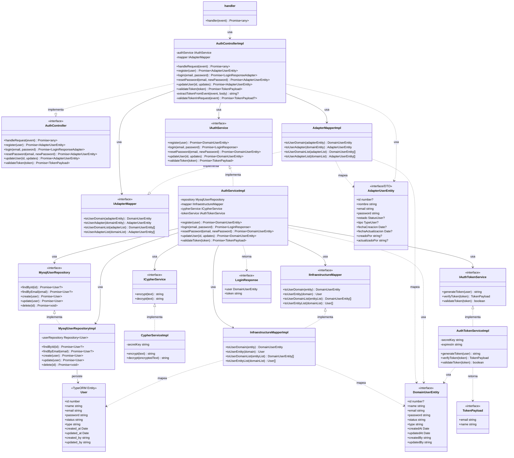
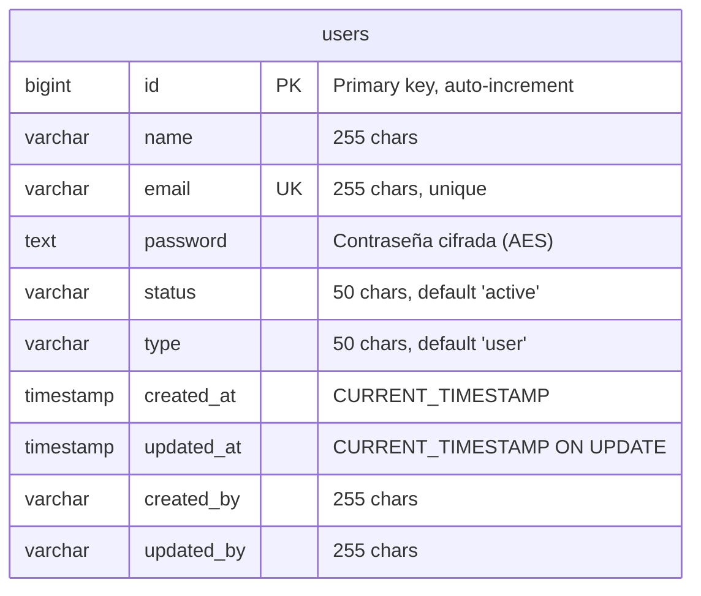
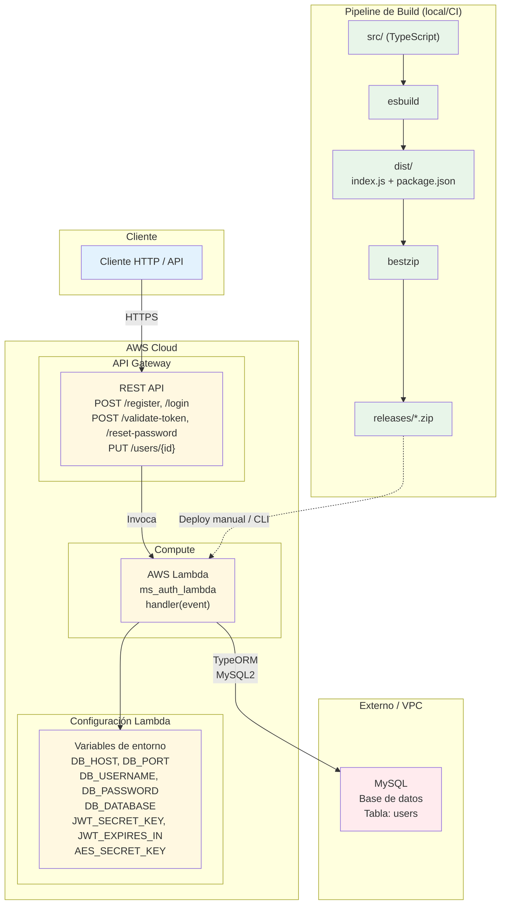
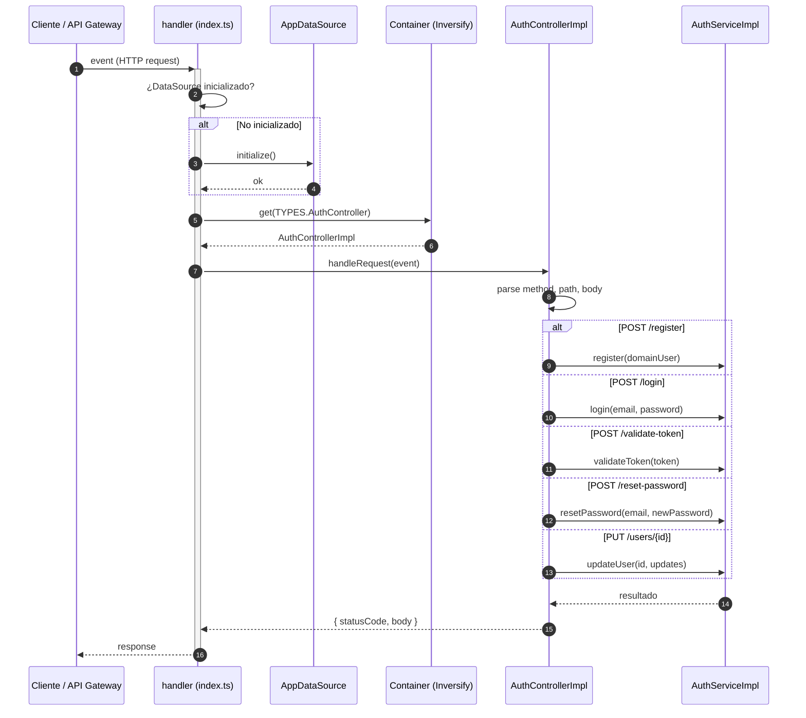

# Documentación - MS Auth Lambda

Índice de la documentación del proyecto.

## Diagramas (Mermaid)

Los archivos `.mmd` se pueden abrir en [Mermaid Live](https://mermaid.live) para visualizar o exportar a PNG/SVG.

### Arquitectura y componentes

| Diagrama | Archivo | Descripción |
|----------|---------|-------------|
| Componentes | [component-diagram.mmd](component-diagram.mmd) | Capas (Entry, Adapter, Application, Domain, Infrastructure) y dependencias entre componentes. |
| Clases | [class-diagram.mmd](class-diagram.mmd) | Interfaces, implementaciones y entidades del proyecto. |
| Entidad-Relación | [er-diagram.mmd](er-diagram.mmd) | Modelo de datos: tabla `users`. |
| Infraestructura | [infrastructure-diagram.mmd](infrastructure-diagram.mmd) | AWS Lambda, API Gateway, MySQL y pipeline de build. |


## Diagrama de Componentes - MS Auth Lambda
### Arquitectura: Clean Architecture / Hexagonal
Entry → Adapter (REST) → Application (Ports) → Domain (Use Cases) → Infrastructure

```mermaid
flowchart TB
    subgraph entry["Entry Point"]
        Handler["handler (index.ts)"]
    end

    subgraph adapter["Adapter - REST"]
        AuthController["AuthController"]
        AuthControllerImpl["AuthControllerImpl"]
        IAdapterMapper["IAdapterMapper"]
        AdapterMapperImpl["AdapterMapperImpl"]
    end

    subgraph application["Application - Ports"]
        IAuthService["IAuthService"]
        IAuthTokenService["IAuthTokenService"]
        ICypherService["ICypherService"]
    end

    subgraph domain["Domain - Use Cases"]
        AuthServiceImpl["AuthServiceImpl"]
        AuthTokenServiceImpl["AuthTokenServiceImpl"]
        CypherServiceImpl["CypherServiceImpl"]
    end

    subgraph infrastructure["Infrastructure"]
        MysqlUserRepository["MysqlUserRepository"]
        MysqlUserRepositoryImpl["MysqlUserRepositoryImpl"]
        IInfraestructureMapper["IInfraestructureMapper"]
        InfraestructureMapperImpl["InfraestructureMapperImpl"]
        AppDataSource["AppDataSource (TypeORM)"]
        UserEntity["User Entity"]
    end

    subgraph entities["Entities"]
        AdapterUserEntity["AdapterUserEntity"]
        DomainUserEntity["DomainUserEntity"]
        LoginResponse["LoginResponse"]
    end

    %% Flujo principal
    Handler -->|"handleRequest"| AuthControllerImpl
    AuthControllerImpl -.->|implements| AuthController
    AuthControllerImpl --> IAuthService
    AuthControllerImpl --> IAdapterMapper
    AdapterMapperImpl -.->|implements| IAdapterMapper
    AuthControllerImpl --> AdapterMapperImpl

    %% Domain implementa Application
    AuthServiceImpl -.->|implements| IAuthService
    AuthTokenServiceImpl -.->|implements| IAuthTokenService
    CypherServiceImpl -.->|implements| ICypherService

    %% AuthServiceImpl depende de
    AuthServiceImpl --> MysqlUserRepository
    AuthServiceImpl --> IInfraestructureMapper
    AuthServiceImpl --> ICypherService
    AuthServiceImpl --> IAuthTokenService
    AuthServiceImpl --> InfraestructureMapperImpl

    %% Infrastructure
    MysqlUserRepositoryImpl -.->|implements| MysqlUserRepository
    AuthServiceImpl --> MysqlUserRepositoryImpl
    InfraestructureMapperImpl -.->|implements| IInfraestructureMapper
    MysqlUserRepositoryImpl -->|"Repository&lt;User&gt;"| AppDataSource
    AppDataSource --> UserEntity

    %% Mappers y entidades
    IAdapterMapper -->|"AdapterUserEntity ↔ DomainUserEntity"| AdapterMapperImpl
    IInfraestructureMapper -->|"User ↔ DomainUserEntity"| InfraestructureMapperImpl
    InfraestructureMapperImpl --> UserEntity
    InfraestructureMapperImpl --> DomainUserEntity
    AuthServiceImpl --> DomainUserEntity
    AuthServiceImpl --> LoginResponse
    AuthControllerImpl --> AdapterUserEntity

    %% Estilos por capa
    classDef entry fill:#e3f2fd
    classDef adapter fill:#fff8e1
    classDef application fill:#f3e5f5
    classDef domain fill:#e8f5e9
    classDef infra fill:#ffebee
    classDef entity fill:#eceff1
    class Handler entry
    class AuthController,AuthControllerImpl,IAdapterMapper,AdapterMapperImpl adapter
    class IAuthService,IAuthTokenService,ICypherService application
    class AuthServiceImpl,AuthTokenServiceImpl,CypherServiceImpl domain
    class MysqlUserRepository,MysqlUserRepositoryImpl,IInfraestructureMapper,InfraestructureMapperImpl,AppDataSource,UserEntity infra
    class AdapterUserEntity,DomainUserEntity,LoginResponse entity

```



## Diagrama de Clases - MS Auth Lambda
### Generado a partir del análisis del código (Clean Architecture)



## Diagrama Entidad-Relación - MS Auth Lambda
### Basado en la entidad TypeORM User (tabla users)
- Base de datos: MySQL



## Diagrama de Infraestructura - MS Auth Lambda
### Despliegue: AWS Lambda + API Gateway + MySQL
- Build: TypeScript + esbuild -> dist -> zip -> Lambda




### Diagramas de secuencia

| Diagrama | Archivo | Descripción |
|----------|---------|-------------|
| Flujo general | [sequence-diagram.mmd](sequence-diagram.mmd) | Entrada a la Lambda y enrutado de peticiones. |
| Registro | [sequence-register.mmd](sequence-register.mmd) | POST /register. |
| Login | [sequence-login.mmd](sequence-login.mmd) | POST /login. |
| Validar token | [sequence-validate-token.mmd](sequence-validate-token.mmd) | POST /validate-token. |
| Reset password | [sequence-reset-password.mmd](sequence-reset-password.mmd) | POST /reset-password. |
| Actualizar usuario | [sequence-update-user.mmd](sequence-update-user.mmd) | PUT /users/{id}. |

## Diagrama de Secuencia - MS Auth Lambda
### Flujo general: Entrada a la Lambda


## Otros documentos

| Documento | Descripción |
|-----------|-------------|
| [environment-variables.md](environment-variables.md) | Variables de entorno: tipo, longitud y uso. |

```mermaid

```
